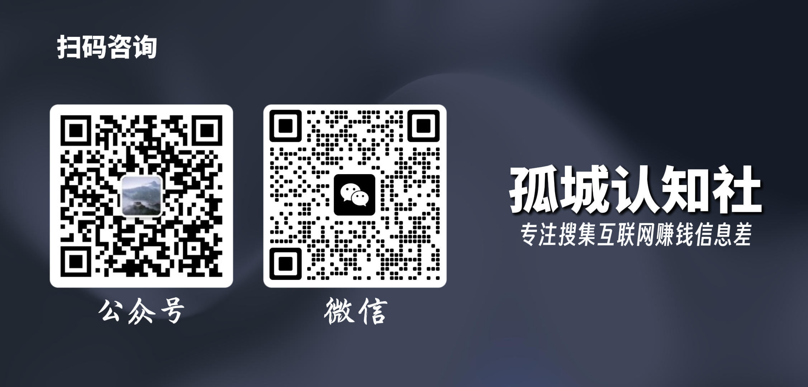

# 孤城认知社介绍

[返回首页]("/#" "返回首页")

## ▍社区权益

**孤城认知社**是古城*（社区创始人）*专为职场和创业人服务的认知思维提升内容共享社区

**核心内容：**互联网认知思维，国际国内时事观点，投资与商业案例分析文档和资料

**年费：** **￥399/每年**，自加入之日算起

专注于收集和整合个人商业认知提升的文章资源库。

1. **国内垂直领域大V** *（国际国内时事、商业投资股票、人生选择提升）*付费认知思维提升文章及合集。
2. **商业赚钱案例库** *（来源年费3000+SC副业社群）*，包括：商业模式、赚钱思考、电商及自媒体等干货文章。
3. **赚钱效率提升工具**，包括：图文创作、视频剪辑、自动化效率工具、电商数据等软硬件合集汇总。

> [完整资源目录（点击查看）](/vip/authnav.md)

## ▍加入方式

有需要加入社群，请添加微信（**linxi9948**）咨询，付费进群

## ▍注意事项

- 孤城认知社为虚拟资料共享社区，网盘分享，售出后不接受退款。
- 孤城本人不会虚假宣传，内容真实靠谱，全部深度编辑加工，长期有效。
- 如违反社区规定，将被孤城请出社群，最终解释权归孤城认知社区所有。

